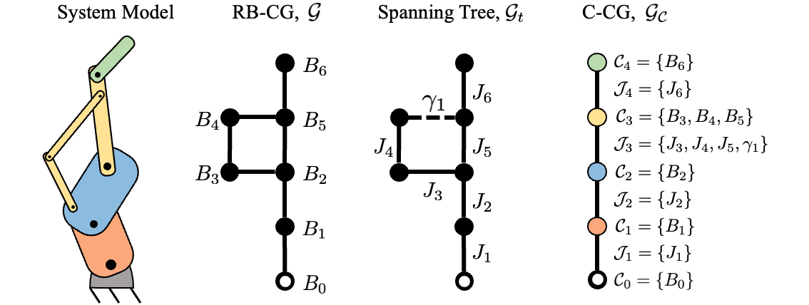

Things this README should contain
- Descriptions of the three types of models (and their common inheritance)
- Descriptions of how the Nodes and Joints relate to the models, with links to the relevant folders
- Simple examples of usage (Specifically setting the state and then calling one of the dynamics functions)

## System Modeling

A popular approach to modeling rigid-body systems is to describe the system in terms of its component parts via a *system model*.
See Chapter 4 of [Rigid Body Dynamics Algorithms](https://link.springer.com/book/10.1007/978-1-4899-7560-7) for more details on modeling rigid-body systems.
This project supports three types of system models:
- [`RigidBodyTreeModel`](RigidBodyTreeModel.h): The classic system model using in [Rigid Body Dynamics Algorithms](https://link.springer.com/book/10.1007/978-1-4899-7560-7) wherein the nodes of the connectivity graph representing the system model are the individual rigid-bodies in the system and the arcs of the graph represent the joints connecting the bodies. The model is capable of representing arbitrary rigid-body systems, including systems with loop constraints such as those induced by actuation sub-mechanisms. However, recursive algorithms can only be applied to this model if it is a kinematic tree (i.e., no loops).
- [`ReflectedInertiaTreeModel`](ReflectedInertiaTreeModel.h): A system model that is similar to the [`RigidBodyTreeModel`](RigidBodyTreeModel.h) in that the nodes of the connectivity graph representing the system model are the individual rigid-bodies in the system and the arcs of the graph represent the joints connecting the bodies. However, the model is only capable of representing kinematic trees (i.e., no loops). The dynamic effects of any loop constraints must be approximated via reflected inertia. This model works reasonably well for systems with geared transmissions, but typically has poor accuracy otherwise.
- [`ClusterTreeModel`](ClusterTreeModel.h): This system model is based on the concept of [Local Constraint Embedding](https://watermark.silverchair.com/139_1.pdf?token=AQECAHi208BE49Ooan9kkhW_Ercy7Dm3ZL_9Cf3qfKAc485ysgAABPswggT3BgkqhkiG9w0BBwagggToMIIE5AIBADCCBN0GCSqGSIb3DQEHATAeBglghkgBZQMEAS4wEQQM_xIaE1ddNZNz0akWAgEQgIIEroMHb7DtoeNXwCrkoyn-X6Wzf2z1aRWC2U6IM-YbWVi1W5HLj4UTZBLSEFibgNkxXYYrMFXill35hTq70_LRlyTOUBS_KGuLuWnFMo90H_YWzZT6XZHEiLbXlCacse6cn81-HWbCpoWJ5YbGarTHHOSvuQskUElfjFhsHTtAEUbSJR6HxNHHwH34zDqRtgEh5CnlT1aea2We9ohKhljlgdLjbik-hLyOx_nTXTtB4KBB7nr9A9gzJn_DLmdKMpLYjkX-jo_Y5O_hUMoF9K4HpVzckQdw03Php4NpuXyng5JLhnzEFbwz9QyNCEu-f8Mwu62r2krTo7t1FkRCR6s8qkCTUZijEYlREIKnSAG3vufSSsawfz40gjCDqOfH2kn9EAPJYsIrZ6bQvhAHT54kj9oPmpedEQqiMCX9rbvmXOPqNR7htAbfjivARim7L3lLl2HX1uE-6mamOEo1H456aP3Tlhb9LY3hoVXMRvsbhEQtG8ECxAJlc-xcGH7Y0h5Cm6n9zEwA9U7-YK3YGr7-0tBzgU_EdevTmFCvZABO0ytbWMRDiP_QJj0wr30jplY9W_j-dGETyWvltx1HhvzKzKTqbbn6EqGNDIVyWJG_IguYqV4Mn9jPCewCILc12vQqfbwlFv5SVq4FkCRN1vQk0IMHh3YyI_16LVE2bQ965MAEonHftU4v3vnueZxxZhNnnzkjNYHJIkLWMeOyzVLZE12avCmuRUuH4WJTHb8VggN3VN6qJbJy1fWPxgjkFl2G22wqLy_SB6la5p2W0uNA80DdOBsMIsN-QJm3zo4DL8M6yljMkadA2f_33HH_RbLOXVq-iOMq5kZBeuE9lgKgiYLqarZuCgO-JXPonL5cIBw4G4D7fY8C6g_n4uB3cFbP-CMjpTuc-vaxjVWqpNok2cobrTEZfTPNRvh8xpRoG3x62oEq55qfrZrK6THQchwiB3sJAlquZBcWJ5SoxnZ-qo5XHP21ia2cPZCiKZmb2EDgPfM5gpOjTLUqlhck3XAEZ0WXEnkz_s4Jr5PBzHA1B8XU98Q25v5PdbopyXevptW-EVUaCH81GnNL9eqknVZWB71GdX9SZ6GoO53RzmixmL_9J5kbMRVuzYF53TbWHUrjP9D2H8WEjanx2-hWDgfxkhCyqcnfHHccUj1SjRT0uXxpx1r2DY-yxhMp-sCphCt_ogyqkkp0nObC1eJbdBAeNvKSmyOiassCQtvv_LW_W4ZCqsLAcoWMjeEFgZ8Ap2I5-JeKVmdo7-vMKQXjV_kt4Fxx43AeEoXoKulPlxI1RcqFUbDg-dCITbyfvLMAc2zYGgOT013U1eQk_lFdbuui2veunfMjkTPaqPi_4tPjNDJ_pRaNQDzgxTFMHkzNVXdhWH8A22sKqY5FSrB9HVqPoQnC4lQcQxSmp5cmOmYunJoDMfZL6fugjMPxyjXJnmSk5o6gMY73U8cQgKOE5vWKWxlEp8jL-epFI7v9YdfRPlECXv6MAiAxeQFbMi--loXNetGRG4VD_I_W9b4Cmnny8Yk596_pVqydcr2b5V8fETtZfSKCm-ZLkAKmCg3IdpS1k0Yxor2j8d_67STKuO4). The nodes of this connectivity graph represent collections of rigid-bodies related to one another by a loop constraint. These collections are referred to as *clusters*. The arcs of the graph represent the joints connecting the clusters, referred to as [*cluster joints*](ClusterJoints/README.md). This model is capable of representing arbitrary rigid-body systems, including systems with loop constraints. Because all cluster connectivity graphs are kinematic trees (no loops in the graph), recursive algorithms can always be applied to this model.

All three system models have connectivity tree structures and thus derive from a common base class, [`TreeModel`](TreeModel.h). 
The first two models are included for benchmarking purposes and are not recommended for general use.

## Constructing a Model

### Procedure
This project does not currently offer support for URDF parsing, so the model has to be constructed manually.
The process for constructing a `ClusterTreeModel` proceeds as follows:
- Register all of the bodies contained in a cluster using the `ClusterTreeModel::registerBody` function for each of the bodies.
    - Function parameters:
        - `name`: A unique name for the body.
        - `inertia`: Spatial inertia of the body.
        - `parent_name`: The name of the parent body.
        - `Xtree`: The tree transforms between the body and its parent. See Chapter 4.2 of [Rigid Body Dynamics Algorithms](https://link.springer.com/book/10.1007/978-1-4899-7560-7) for more details.
- Append those bodies to the model using the `ClusterTreeModel::appendRegisteredBodiesAsCluster` function.
    - Function templates:
        - `ClusterJointType`: The type of generalized joint connecting the bodies in the cluster. See [Generalized Joints](ClusterJoints/README.md) for more details.
        - `... Args`: Variadic template for the arguments to the constructor of the `ClusterJointType`.
    - Function parameters:
        - `name`: A unique name for the cluster.
        - `... args`: Arguments to the constructor of the `ClusterJointType`.
- NOTE: In cases where the cluster contains a single body, the two steps above can be combined using the `ClusterTreeModel::appendBody` function.
    - Function templates:
        - `ClusterJointType`: The type of generalized joint connecting the bodies in the cluster.
        - `... Args`: Variadic template for the arguments to the constructor of the `ClusterJointType`.
    - Function parameters:
        - `name`: A unique name for the cluster.
        - `inertia`: Spatial inertia of the body.
        - `parent_name`: The name of the parent body.
        - `Xtree`: The tree transforms between the body and its parent.
        - `... args`: Arguments to the constructor of the `ClusterJointType`.

`RigidBodyTree` and `ReflectedInertiaTree` models are constructed automatically from `ClusterTreeModel`s.
### Example
For example, consider the following system model:

   

Constructing this model would involve the following steps:
1. Append Body $B_1$ by calling `ClusterTreeModel::appendBody` using `GeneralizedJoint::Revolute` as the `GenJointType` template
2. Append Body $B_2$ by calling `ClusterTreeModel::appendBody` using `GeneralizedJoint::Revolute` as the `GenJointType` template
3. Register bodies $B_3$, $B_4$, and $B_5$ using `ClusterTreeModel::registerBody`. Append them as a cluster using `ClusterTreeModel::appendRegisteredBodiesAsCluster` with `GeneralizedJoint::Generic` as the `GenJointType` template. (Note that the generic joint must be used in this case because we have not yet implemented a specialized class for dealing with four bar linkages.)
4. Append Body $B_6$ by calling `ClusterTreeModel::appendBody` using `GeneralizedJoint::Revolute` as the `GenJointType` template
