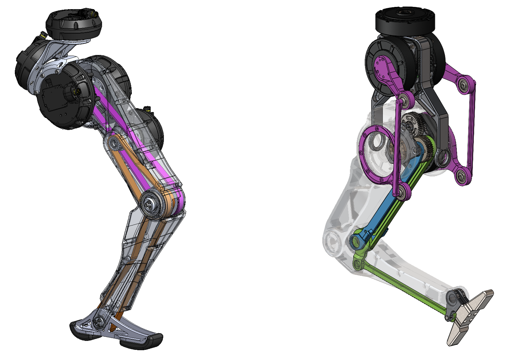
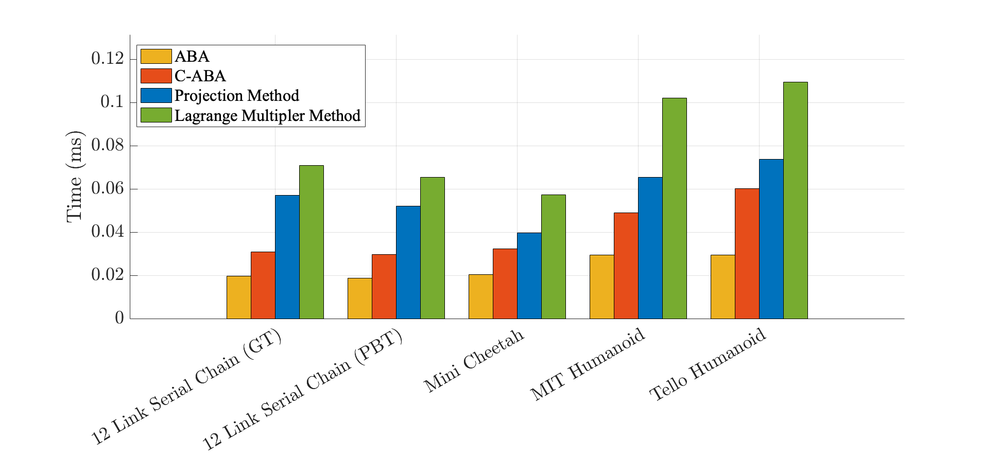
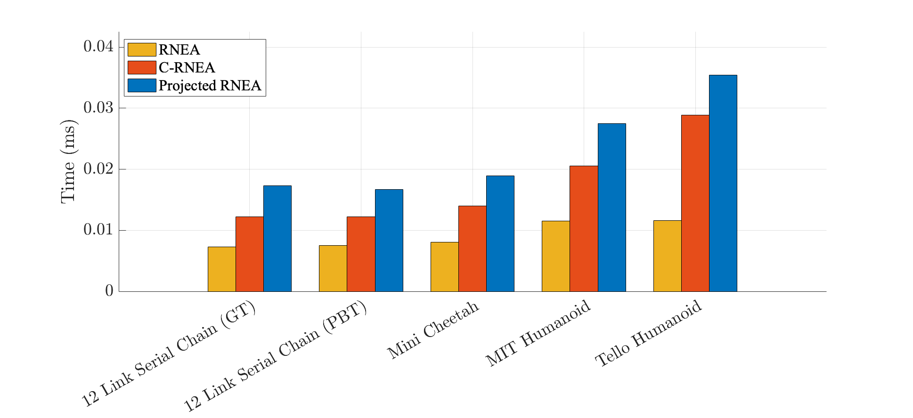
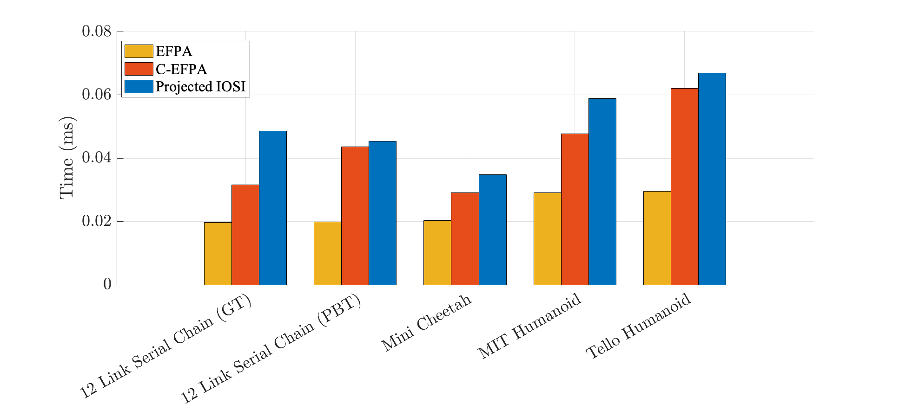

# DynamicsEngine

This repository contains a C++ library of generalized rigid-body dynamics algorithms.
The algorithms are based on the recursive algorithms of [Featherstone](http://royfeatherstone.org/), but modified such that they can efficiently compute the constrained dynamics of robotic systems with actuation sub-mechanisms.
Actuation sub-mechanisms (e.g., geared transmissions, differential drives, and linkages) are increasingly common in robotic systems, yet to date there has been no efficient method for computing their dynamics.
The reason for this is that actuation sub-mechanisms induce local kinematic loops on the system that violate the assumptions of conventional recursive dynamics algorithms.
The key insight of our generalized algorithms is the clustering of bodies involved in local loop constraints.
Clustering bodies enables loop constraints to be resolved locally, i.e., only when that group of bodies is encountered during a forward or backward pass.
Our approach is functionally similar to Jain's [Local Constraint Embedding](https://watermark.silverchair.com/139_1.pdf?token=AQECAHi208BE49Ooan9kkhW_Ercy7Dm3ZL_9Cf3qfKAc485ysgAABPswggT3BgkqhkiG9w0BBwagggToMIIE5AIBADCCBN0GCSqGSIb3DQEHATAeBglghkgBZQMEAS4wEQQM_xIaE1ddNZNz0akWAgEQgIIEroMHb7DtoeNXwCrkoyn-X6Wzf2z1aRWC2U6IM-YbWVi1W5HLj4UTZBLSEFibgNkxXYYrMFXill35hTq70_LRlyTOUBS_KGuLuWnFMo90H_YWzZT6XZHEiLbXlCacse6cn81-HWbCpoWJ5YbGarTHHOSvuQskUElfjFhsHTtAEUbSJR6HxNHHwH34zDqRtgEh5CnlT1aea2We9ohKhljlgdLjbik-hLyOx_nTXTtB4KBB7nr9A9gzJn_DLmdKMpLYjkX-jo_Y5O_hUMoF9K4HpVzckQdw03Php4NpuXyng5JLhnzEFbwz9QyNCEu-f8Mwu62r2krTo7t1FkRCR6s8qkCTUZijEYlREIKnSAG3vufSSsawfz40gjCDqOfH2kn9EAPJYsIrZ6bQvhAHT54kj9oPmpedEQqiMCX9rbvmXOPqNR7htAbfjivARim7L3lLl2HX1uE-6mamOEo1H456aP3Tlhb9LY3hoVXMRvsbhEQtG8ECxAJlc-xcGH7Y0h5Cm6n9zEwA9U7-YK3YGr7-0tBzgU_EdevTmFCvZABO0ytbWMRDiP_QJj0wr30jplY9W_j-dGETyWvltx1HhvzKzKTqbbn6EqGNDIVyWJG_IguYqV4Mn9jPCewCILc12vQqfbwlFv5SVq4FkCRN1vQk0IMHh3YyI_16LVE2bQ965MAEonHftU4v3vnueZxxZhNnnzkjNYHJIkLWMeOyzVLZE12avCmuRUuH4WJTHb8VggN3VN6qJbJy1fWPxgjkFl2G22wqLy_SB6la5p2W0uNA80DdOBsMIsN-QJm3zo4DL8M6yljMkadA2f_33HH_RbLOXVq-iOMq5kZBeuE9lgKgiYLqarZuCgO-JXPonL5cIBw4G4D7fY8C6g_n4uB3cFbP-CMjpTuc-vaxjVWqpNok2cobrTEZfTPNRvh8xpRoG3x62oEq55qfrZrK6THQchwiB3sJAlquZBcWJ5SoxnZ-qo5XHP21ia2cPZCiKZmb2EDgPfM5gpOjTLUqlhck3XAEZ0WXEnkz_s4Jr5PBzHA1B8XU98Q25v5PdbopyXevptW-EVUaCH81GnNL9eqknVZWB71GdX9SZ6GoO53RzmixmL_9J5kbMRVuzYF53TbWHUrjP9D2H8WEjanx2-hWDgfxkhCyqcnfHHccUj1SjRT0uXxpx1r2DY-yxhMp-sCphCt_ogyqkkp0nObC1eJbdBAeNvKSmyOiassCQtvv_LW_W4ZCqsLAcoWMjeEFgZ8Ap2I5-JeKVmdo7-vMKQXjV_kt4Fxx43AeEoXoKulPlxI1RcqFUbDg-dCITbyfvLMAc2zYGgOT013U1eQk_lFdbuui2veunfMjkTPaqPi_4tPjNDJ_pRaNQDzgxTFMHkzNVXdhWH8A22sKqY5FSrB9HVqPoQnC4lQcQxSmp5cmOmYunJoDMfZL6fugjMPxyjXJnmSk5o6gMY73U8cQgKOE5vWKWxlEp8jL-epFI7v9YdfRPlECXv6MAiAxeQFbMi--loXNetGRG4VD_I_W9b4Cmnny8Yk596_pVqydcr2b5V8fETtZfSKCm-ZLkAKmCg3IdpS1k0Yxor2j8d_67STKuO4), but the derivation is decidedly different, placing an emphasis on generalizing the concept of an articulated body to the case of body clusters, which should increase accessibility for roboticists.
<div style="text-align:center;">
   
</div>

## Table of Contents

1. [Installation](#installation)
2. [Usage](#usage)
3. [Configuration](#configuration)
4. [Benchmarking](#benchmarking)
5. [Contributing](#contributing)
6. [Testing](#testing)
7. [License](#license)
8. [Contact Information](#contact-information)
9. [Citation](#citation)

## Installation
### Dependencies
- C++17 or higher
- CMake 3.20 or higher
- Eigen 3.3.7 or higher

### Supported Operating Systems
- Ubuntu 18.04 or higher
- MacOS 10.15 or higher (Note: When compiling on a machine with Apple M1 chip, you can optimize the performance by using the following command: `cmake -DM1_BUILD=ON ..`)

### Building
To run the unit tests and bencmarks
- Create a build directory: `mkdir build && cd build`
- Run CMake: `cmake ..`
- Build: `make`
- Unit tests can be run all at once with `./bin/unit_tests` or individually with `./bin/<name-of-unit-test-binary>`
- Benchmarks can be run with the shell scripts `../Benchmarking/run_time_benchmark.sh` or `../Benchmarking/run_accuracy_benchmarks.sh`

To incorporate the library into your own project, see [Configuration](#configuration).

## Usage

As a general purpose rigid-body dynamics library, the project can be used in a variety of ways.
The most common uses are as follows:
- **Dynamic Simulation**: Using the constrained forward dynamics algorithms and the contact dynamics algorithms, the repository can be used as part of a simulator for contact-rich robotic systems.
- **Model-Based Control**: Using the inverse dynamics algorithms, the repository can be used to as part of a whole-body controller to compute the control torques required to achieve a desired state.

At this time, we do not offer support for URDF parsing, so the model has to be constructed manually.
The process for building a model proceeds as follows:
- Register all of the bodies contained in a cluster by providing their connectivity and inertia information.
- Append those bodies to the model by providing information about the cluster joint that connects them.
- Repeat the above steps for each cluster in the system.
Specific examples of how to build a model can be found in the [Robots](Robots/) folder, along with a more detailed [README](Dynamics/README.md) detailing the process.

## Configuration

The project is currently set up to be incorporated as a submodule in another project that is built with CMake.
For more information about using submodules, see [this tutorial](https://github.blog/2016-02-01-working-with-submodules/).
To incorporate the repo as a submodule in your project simply initialize the submodule in the desired directory of your project and then include it in the CMake build via the `add_subdirectory` command.

## Benchmarking
We have included a set of [benchmarks](Benchmarking/) to compare the performance of our algorithms against existing algorithms.
We test the algorithms on the following robots:
- [12 Link Serial Chain Actuated via Geared Transmissions](Robots/SerialChains/RevoluteChainWithRotor.hpp)
- [12 Link Serial Chain Actuated via Paralell Belt Transmissions](Robots/SerialChains/RevolutePairChainWithRotor.hpp)
- [MIT Mini Cheetah Quadruped](Robots/MiniCheetah.hpp)
- [MIT Humanoid Robot](Robots/MIT_Humanoid.hpp)
- [Tello Humanoid Robot](Robots/TelloWithArms.hpp)

### Forward Dynamics
We compare our constrained forward dynamics algorithm, the Cluster-based Articulated Body Algorithm (C-ABA) against the following algorithms:
- **Articulated Body Algorithm (ABA)**: The conventional recursive algorithm for computing the forward dynamics of kinematic chains and branched models. This algorithm is not capable of handling actuation sub-mechanisms.
- **Projection Method**: A non-recursive algorithm that computes the constrained forward dynamics by projecting the equations of motion for the spanning tree coordinates onto the independent coordinates. See Method 3 in Chapter 8.5 of [Rigid Body Dynamics Algorithms](https://link.springer.com/book/10.1007/978-1-4899-7560-7) for more details.
- **Lagrange Multiplier Method**: A non-recusrive algorithm that first computes the constraint forces necessary to satisfy closed loop constraints and then uses those forces to compute the forward dynamics. See Method 2 in Chapter 8.5 of [Rigid Body Dynamics Algorithms](https://link.springer.com/book/10.1007/978-1-4899-7560-7) for more details.

<div style="text-align:center;">
   
</div>

### Inverse Dynamics
We compare our constrained inverse dynamics algorithm, the Cluster-based Recursive Newton-Euler Algorithm (C-RNEA) against the following algorithms:
- **Recursive Newton-Euler Algorithm (RNEA)**: The conventional recursive algorithm for computing the inverse dynamics of kinematic chains and branched models. This algorithm is not capable of handling actuation sub-mechanisms.
- **Projected RNEA**: Computes the inverse dynamics of the spanning tree via RNEA by ignoring the closed loop constraints, and then projects the resulting generalized forces $\tau$ onto the independent coordinates. See Chapter 8.12 of [Rigid Body Dynamics Algorithms](https://link.springer.com/book/10.1007/978-1-4899-7560-7) for more details.

<div style="text-align:center;">
   
</div>

### Inverse Operational-Space Inertia Matrix
We compaore our constrained inverse operational-space inertia matrix algorithm, the Cluster-based Extended Force Propagator Algorithm (C-EFPA) against the following algorithms:
- **[Extended Force Propagator Algorithm (EFPA)](https://www3.nd.edu/~pwensing/Papers/WensingFeatherstoneOrin12-ICRA.pdf)**: The conventional recursive algorithm for computing the inverse operational-space inertia matrix of kinematic chains and branched models. This algorithm is not capable of handling actuation sub-mechanisms.
- **Projected EFPA**: Computes the inverse operational-space inertia matrix of the spanning tree via EFPA by ignoring the closed loop constraints, and then projects the resulting matrix onto the independent coordinates.

<div style="text-align:center;">
   
</div>

## Contributing
- Provide guidelines for contributors, including how to submit bug reports, feature requests, or pull requests.
- Specify your preferred coding style or conventions.
- Explain the process of contributing to the project.

## License
The code is licensed under the MIT license. See the [LICENSE](LICENSE) file for more details.

## Contact Information:
For further questions or collaboration inquiries, please contact the developers at:
- [Matthew Chignoli](mailto:chignoli@mit.edu)

## Citation
If you use this code in your research, please cite the repository as follows:
```
@misc{grbdaweb,
   author = {Matthew Chignoli, Nicholas Adrian, Patrick M. Wensing, and others},
   title = {GRBDA: Generalzied Rigid-Body Dynamics Algorithms},
   howpublished = {https://github.com/ROAM-Lab-ND/generalized_rbda},
   year = {2023}
}
```
